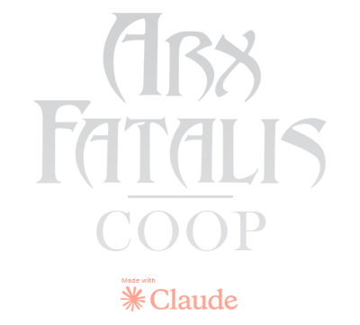

  

  
  

# ArxCoop — Arx Fatalis co-op for 2 to 4 players

A co-op mod for **Arx Fatalis**, built on the open-source [Arx Libertatis](https://arx-libertatis.org/) engine.
One player hosts, the others join: everybody plays the adventure together in the same world, each with
their own character. English and French.

Tested on Arx Fatalis 1.21 (GOG) with Arx Libertatis 1.2 installed. The mod ships its own engine build
(based on Arx Libertatis 1.3-dev) and does not touch the original game.

*[Version française plus bas.](#version-française)*

> You need your own copy of Arx Fatalis (GOG or Steam). No game data is provided here.

---

## Contents

- [Download and install](#download-and-install)
- [Playing](#playing)
- [Features](#features)
- [Synchronisation status](#synchronisation-status)
- [Custom face (tutorial)](#custom-face-tutorial)
- [Custom menu skin](#custom-menu-skin)
- [Admin menu (F8)](#admin-menu-f8)
- [Keys](#keys)
- [Known limits](#known-limits)
- [Building](#building)
- [Credits and license](#credits-and-license)
- [Version française](#version-française)

---

## Download and install

1. Download the zip of the [latest release](https://github.com/Parricidium/ArxCoop/releases/latest).
2. Unzip it **into your Arx Fatalis folder** (the one that contains `data.pak`).
   Nothing is overwritten: `arx.exe` is an extra executable, the original game stays intact.
3. On first launch Windows may ask for network permission: allow it (private network).

The mod keeps **everything** (saves, settings, faces) in `userdata\` next to `arx.exe`, never in
"Saved Games". Your original saves are safe.

**Updating**: unzip the new version over the old one. Everybody must run the same version (the network
protocol number is checked when joining).

**Language**: the mod follows the game language (*Options > Language*): English or French.

## Playing

| Role | How |
|---|---|
| **Host** | `heberger.cmd`, or *Co-op > Host a game* in the menu (nickname, port), or `arx.exe --coop-host 27015 --nickname MyName` |
| **Join** | `rejoindre.cmd`, or *Co-op > Join a game* (nickname, address, port, favourites), or `arx.exe --coop-join 192.168.1.10:27015 --nickname MyName` |

- Same LAN or a VPN (Radmin VPN, Hamachi, ZeroTier). Over the internet the host opens **TCP port 27015**.
  The *Host* page shows your local and public IP to give to your friends.
- Everybody meets in the **lobby**. The host has two buttons there:
  **"Continue: \<last save\>"** (each player automatically reloads their "coop: …" character, or creates
  one if new) and **"Start from the beginning"** (everybody creates a character).
- **Joining a game in progress** works: the newcomer creates (or reloads) their character and receives
  the level, quests, keys, runes, backpacks and the party's XP.
- **Saving**: only the host saves (F5 or menu). Every other player then saves their character as
  "coop: \<name\>". When the host loads a save, everybody reloads theirs.
- **Disconnection**: whoever crashed just joins again: they come back with their character (auto-saved
  every 3 minutes) and the host puts them back where they were.

## Features

**Shared world**
- The world belongs to the host and is seen by everybody: NPCs (position, animations, life,
  dismemberment, blood), doors, levers, traps, chests, merchants, ground items, quests, keys, runes,
  script variables.
- Whatever one player triggers (dialogue, pass granted by an NPC, path cleared, lever…) counts for all.
- NPCs target the nearest player; the damage you take is really yours.
- Items: what a player picks up disappears for the others; what they drop or throw reappears for them.
  Chests and merchants are shared (storing, selling, buying, stacks, gold coins).
- Each player keeps **their own** character: stats, skill points, inventory, equipment, purse. Quest gold
  and XP go to everybody; combat XP is shared.
- A backpack used by anyone enlarges everybody's inventory.
- The host's world sounds (hits, impacts, NPCs) are heard by all.

**The other players**
- Seen with their head (or **custom face**), armour, weapon, torch and animations (running, jumping,
  crouching, fighting, casting, leaning, talking head).
- Teammates' spells are visible (damage computed by the caster).
- **Hand over an item**: right-click it in your inventory, then click the teammate.
- Teammates' name, life and hunger on the left of the screen; ping next to the names; play time at the top.
- Off-screen teammates: arrow at the edge of the screen with the distance, shown on the minimap and
  the book map.
- **Middle click**: "over here" marker (red double circle with the distance, 12 s, seen by all).

**Death and revival**
- At 0 HP you stay **down** ("X is down!" + sound) with a 2-minute countdown.
- A teammate holds **left click** while looking at you up close (~2 m) for 4 s to get you up (gauge
  shown), or uses a **life potion** (H key) while looking at you: instant revival.
- Everybody down = game over.

**Cutscenes and dialogues**
- The camera of a dialogue is given only to whoever triggered it; the others hear the line.
  Anyone's Escape skips the line for all.
- Option "freeze me while a teammate is in a dialogue".
- At the end of a scene that moved the host (intro, Polsius…) or after a level change, teammates left
  behind are teleported next to them.
- The host's menu does not pause the world.

**Third-person view**
- **V**: first person / over-the-shoulder camera. **N**: switch shoulder. **O**: free camera (the mouse
  orbits around the character). **Wheel**: closer / further. The camera moves in by itself near walls.

**Comfort**
- The game starts straight on the menu (intro skipped; `skip_intro=false` in `userdata\cfg.ini` to get
  it back).
- Menu skin included ("Arx Fatalis COOP" background, frame, panel), replaceable with yours.
- Full English translation of the mod.

## Synchronisation status

| Item | Status | Note |
|---|:---:|---|
| Player position, angle, animations (4 layers) | ✅ | 20 Hz, smoothed |
| Visible equipment (armour, weapon, shield, torch), head, face | ✅ | |
| NPCs: position, animations, life, death, visibility, dismemberment | ✅ | AI and physics on the host, 10 Hz |
| Damage NPC → players, players → NPCs, player ↔ player | ✅ | through the host |
| Blood, world sounds | ✅ | |
| World scripts (doors, levers, traps, passages, `objecthide/destroy/…`) | ✅ | replayed on the clients |
| Script variables (quest flags) | ✅ | both directions |
| Quest log, keys, runes | ✅ | + sent to late joiners |
| XP, quest gold, backpacks | ✅ | XP shared; catch-up on joining |
| Picked-up gold / selling | ✅ | stays with whoever does it (own purse) |
| Ground items (pick up, drop, throw, carry) | ✅ | |
| Chests, merchants, corpses (store, sell, buy, stacks, coins) | ✅ | |
| Items created by scripts inside containers | ✅ | same id everywhere |
| Handing items between players | ✅ | durability and poison kept |
| Spells | ✅ | visuals everywhere, damage at the caster |
| Persistent magic fields ("blue walls") | ✅ | recreated on arrival |
| Level change | ✅ | grouped, led by the host |
| Save / load | ✅ | host + everybody's character |
| Joining in progress, reconnecting | ✅ | |
| Scripted cutscenes | ✅ | camera for the initiator only |
| Markers, chat, ping | ✅ | |
| Real internet latency | ⚠️ | designed for LAN / VPN, little tested beyond |
| Cutscene camera for everybody | ❌ | design choice |

## Custom face (tutorial)

Your face replaces the hero's: the other players see it on your character, and you see it in the book.

1. Launch the mod, go to **Options > Co-op**.
2. Click **"Open the faces folder"**: the folder `userdata\coop\faces\` is created and opened.
3. Drop your photo there (`jpg` or `png`). **Tight crop on the face, front view**: from the top of the
   forehead to the chin, no hair, no shoulders (see `visages\cadrage_photo.png`: everything inside the
   green oval is pasted on the face, the rest blends into the game head). The game crops to 5:7 and
   scales the photo by itself; a photo that is too wide gives a tiny face.
4. Go back to the *Co-op* page and pick your file under **"Face"**: the character's head is shown in 3D
   below, with your face.
5. Done. The photo is sent once to the other players (20–40 KB), and nowhere else.

For tinkerers: a **full head**. Edit `visages\tete_hero_N_skin.png` (N = 1 to 4; `*_zones.png` shows
where the face lands) and save it in the faces folder with `_skin` in the name (e.g. `bob_skin.png`):
it is then used as is (bare head; with chainmail or hood the game head comes back).

## Custom menu skin

Three images in `userdata\coop\` (png, jpg or bmp; delete the file to get the original game look back):

| File | Role | Format |
|---|---|---|
| `menu_background.*` | main menu background (replaces the original picture, logo included) | 16:9 advised, stretched to the screen |
| `menu_panel.*` | menu frame background — it **darkens** what is behind (white = nothing, black = opaque) | 321×419 |
| `menu_border.*` | frame border | 322×424, PNG with transparency (or black = transparent) |

"Open the faces folder" also exports the original pictures to `userdata\coop\menu_modeles\`.
The mod ships with its own skin; updates put it back.

## Admin menu (F8)

Opened in game (the world keeps running), key configurable in *Options > Controls*.

- **Host**: pick a player then *teleport them to me*, *teleport me to them*, *revive and heal*, give
  *gold*, *XP*, *an item* (class name: `potion_life`, `short_sword`, `gold_coin`, `ring_regeneration`…
  an approximate name lists the possible ones), *kick*.
  For everybody: *everyone to me*, *heal everyone*, *invulnerability*, *kill hostile NPCs* around me
  (20 m, to get out of a jam), *save now*.
- **Client**: *teleport me to this player* (if you are stuck in the level).

Console (`²` key on French keyboards, the key left of `1`): `tp p2` teleports player 2 next to you,
`tp Name`, `tp all`.

## Keys

All configurable in *Options > Controls*.

| Key | Action |
|---|---|
| **V** | first / third person view |
| **N** | switch shoulder |
| **O** | free camera (third person) |
| **Wheel** | camera closer / further |
| **Middle click** | "over here" marker |
| **Hold left click** on a downed teammate | revive them |
| **H** while looking at a downed teammate | life potion on them |
| **F8** | admin menu |
| **²** | console |

## Known limits

- Designed for LAN or VPN; never tested with real internet latency.
- Spell damage is computed by whoever casts the spell.
- The camera of story cutscenes is given only to whoever triggers them.
- Windows only for the provided binaries (the code builds elsewhere like Arx Libertatis, untested).

## Building

This is a fork of Arx Libertatis: same dependencies and procedure (see
[README.ArxLibertatis.md](README.ArxLibertatis.md)). The mod code lives in `src/coop/` (network,
session, replication, puppets, faces, admin, third person) plus hooks in the engine. On Windows:
CMake + Visual Studio 2022, `cmake --build build --config Release`. The non-binary package files
(LISEZMOI, translation, face templates, menu skin) are in `dist/`.

## Credits and license

- [Arx Libertatis](https://arx-libertatis.org/) and its contributors, based on the Arx Fatalis source
  code released by Arkane Studios.
- Co-op part: JD, with the assistance of Claude (Anthropic).
- License **GPLv3+** with the Arx Libertatis additional terms: see [COPYING](COPYING) and [LICENSE](LICENSE).
  Arx Fatalis, its data and trademarks remain the property of their owners.

---

# Version française

Mod coopératif pour **Arx Fatalis**, construit sur le moteur libre [Arx Libertatis](https://arx-libertatis.org/).
Un joueur héberge, les autres le rejoignent : tout le monde joue l'aventure ensemble, dans le même monde,
chacun avec son propre personnage. Français et anglais.

Testé sur Arx Fatalis 1.21 (GOG) avec Arx Libertatis 1.2 installé. Le mod apporte son propre moteur
(basé sur Arx Libertatis 1.3-dev) et ne touche pas au jeu d'origine.

> Vous devez posséder Arx Fatalis (GOG ou Steam). Aucune donnée du jeu n'est fournie ici.

## Téléchargement et installation

1. Téléchargez le zip de la [dernière version](https://github.com/Parricidium/ArxCoop/releases/latest).
2. Dézippez-le **dans le dossier d'Arx Fatalis** (celui qui contient `data.pak`).
   Rien n'est écrasé : `arx.exe` est un exécutable en plus, le jeu d'origine reste intact.
3. Au premier lancement, Windows demandera peut-être l'autorisation réseau : acceptez (réseau privé).

Le mod range **tout** (sauvegardes, configuration, visages) dans `userdata\` à côté de `arx.exe`,
jamais dans « Parties enregistrées ». Vos sauvegardes du jeu d'origine ne risquent rien.

**Mise à jour** : dézippez la nouvelle version par-dessus. Tout le monde doit avoir la même version
(le numéro de protocole est vérifié à la connexion).

**Langue** : le mod suit la langue du jeu (Options > Language) : français ou anglais.

## Jouer

| Rôle | Comment |
|---|---|
| **Héberger** | `heberger.cmd`, ou menu *Coopération > Héberger une partie* (pseudo, port), ou `arx.exe --coop-host 27015 --nickname MonPseudo` |
| **Rejoindre** | `rejoindre.cmd`, ou menu *Coopération > Rejoindre une partie* (pseudo, adresse, port, favoris), ou `arx.exe --coop-join 192.168.1.10:27015 --nickname MonPseudo` |

- Même réseau local ou VPN (Radmin VPN, Hamachi, ZeroTier). Par internet, l'hôte ouvre le port **TCP 27015**.
  La page *Héberger* affiche votre IP locale et votre IP internet, à donner à vos amis.
- Tout le monde arrive dans le **salon**. L'hôte y a deux boutons :
  **« Continuer : \<dernière sauvegarde\> »** (chacun recharge automatiquement son personnage « coop: … »,
  ou en crée un s'il est nouveau) et **« Commencer du début »** (chacun crée son personnage).
- On peut **rejoindre une partie en cours** : le nouveau venu crée son personnage (ou recharge le sien)
  et reçoit le niveau, les quêtes, clés, runes, sacs et l'XP du groupe.
- **Sauvegarde** : seul l'hôte sauvegarde (F5 ou menu). Chaque autre joueur sauvegarde alors son
  personnage sous « coop: \<nom\> ». Quand l'hôte charge une sauvegarde, chacun recharge la sienne.
- **Déconnexion** : celui qui plante relance *Rejoindre* : il revient avec son personnage
  (sauvegarde automatique toutes les 3 min) et l'hôte le remet là où il était.

## Fonctionnalités

**Monde partagé**
- Le monde appartient à l'hôte et est vu par tous : PNJ (position, animations, vie, démembrements, sang),
  portes, leviers, pièges, coffres, marchands, objets au sol, quêtes, clés, runes, variables des scripts.
- Ce qu'un joueur déclenche (dialogue, laissez-passer, passage dégagé, levier…) vaut pour tout le monde.
- Les PNJ ciblent le joueur le plus proche ; les dégâts que vous prenez sont bien les vôtres.
- Objets : ce qu'un joueur ramasse disparaît pour les autres ; ce qu'il pose ou jette réapparaît chez eux.
  Coffres et marchands sont communs (dépôt, vente, achat, piles, pièces d'or).
- Chaque joueur garde **son** personnage : stats, points, inventaire, équipement, bourse. L'or et l'XP
  donnés par les quêtes vont à tout le monde ; l'XP des combats est partagée.
- Un sac à dos utilisé par n'importe qui agrandit l'inventaire de tout le monde.
- Les sons du monde de l'hôte (coups, impacts, PNJ) sont entendus par tous.

**Les autres joueurs**
- Vus avec leur tête (ou leur **visage personnalisé**), leur armure, leur arme, leur torche, leurs
  animations (course, saut, accroupi, combat, sorts, penchés, tête qui parle).
- Sorts des coéquipiers visibles (dégâts calculés chez le lanceur).
- **Donner un objet** : clic droit sur l'objet dans l'inventaire, puis clic sur le coéquipier.
- Pseudo, vie et faim des coéquipiers à gauche de l'écran ; ping à côté des noms ; temps de jeu en haut.
- Coéquipiers hors champ : flèche au bord de l'écran avec la distance, présence sur la mini-carte et la carte du livre.
- **Clic molette** : marqueur « par ici » (double cercle rouge avec la distance, 12 s, visible par tous).

**Mort et réanimation**
- À 0 PV on reste **à terre** (« X est à terre ! » + signal sonore) avec un compte à rebours de 2 minutes.
- Un coéquipier maintient **clic gauche** en vous regardant de près (~2 m) pendant 4 s pour vous relever
  (jauge affichée), ou utilise une **potion de vie** (touche H) en vous regardant : relevé instantané.
- Tout le monde à terre = fin de partie.

**Cinématiques et dialogues**
- La caméra d'un dialogue n'est donnée qu'à celui qui l'a déclenché ; les autres entendent la réplique.
  Un Échap de n'importe qui passe la réplique pour tous.
- Option « me figer quand un coéquipier dialogue ».
- À la fin d'une scène qui a déplacé l'hôte (intro, Polsius…) ou d'un changement de niveau, les
  coéquipiers restés loin sont téléportés à côté de lui.
- Le menu de l'hôte ne met pas le monde en pause.

**Vue à la 3e personne**
- **V** : vue subjective / caméra par-dessus l'épaule. **N** : changer d'épaule. **O** : caméra libre
  (la souris tourne autour du personnage). **Molette** : rapprocher / éloigner. La caméra se rapproche
  toute seule devant un mur.

**Confort**
- Le jeu démarre directement sur le menu (intro passée ; `skip_intro=false` dans `userdata\cfg.ini` pour la retrouver).
- Habillage des menus fourni (fond « Arx Fatalis COOP », cadre, panneau) et remplaçable par le vôtre.
- Traduction anglaise complète du mod.

## État des synchronisations

| Élément | État | Remarque |
|---|:---:|---|
| Position, angle, animations des joueurs (4 couches) | ✅ | 20 Hz, lissage |
| Équipement visible (armure, arme, bouclier, torche), tête, visage | ✅ | |
| PNJ : position, animations, vie, mort, visibilité, démembrements | ✅ | IA et physique chez l'hôte, 10 Hz |
| Dégâts PNJ → joueurs, joueurs → PNJ, joueur ↔ joueur | ✅ | via l'hôte |
| Sang, sons du monde | ✅ | |
| Scripts du monde (portes, leviers, pièges, passages, `objecthide/destroy/…`) | ✅ | rejoués chez les clients |
| Variables des scripts (flags de quête) | ✅ | dans les deux sens |
| Journal de quêtes, clés, runes | ✅ | + envoyés à qui rejoint |
| XP, or des quêtes, sacs à dos | ✅ | XP partagée ; rattrapage à l'arrivée |
| Or ramassé / vente | ✅ | reste à celui qui le fait (bourse individuelle) |
| Objets au sol (prise, dépôt, lancer, transport) | ✅ | |
| Coffres, marchands, cadavres (dépôt, vente, achat, piles, pièces) | ✅ | |
| Objets créés par script dans un conteneur | ✅ | même identifiant partout |
| Don d'objet entre joueurs | ✅ | durabilité et poison conservés |
| Sorts | ✅ | visuels partout, dégâts chez le lanceur |
| Champs magiques persistants (« murs bleus ») | ✅ | recréés à l'arrivée |
| Changement de niveau | ✅ | groupé, mené par l'hôte |
| Sauvegarde / chargement | ✅ | hôte + perso de chacun |
| Rejoindre en cours de partie, reconnexion | ✅ | |
| Cinématiques scriptées | ✅ | caméra pour l'initiateur seulement |
| Marqueurs, chat, ping | ✅ | |
| Latence internet réelle | ⚠️ | conçu pour le LAN / VPN, peu testé au-delà |
| Caméra des cinématiques pour tous | ❌ | choix de conception |

## Changer son visage (tuto)

Votre visage remplace celui du héros : les autres joueurs le voient sur votre personnage, et vous le
voyez dans le livre.

1. Lancez le mod, allez dans **Options > Coopération**.
2. Cliquez **« Ouvrir le dossier des visages »** : le dossier `userdata\coop\faces\` est créé et s'ouvre.
3. Déposez-y votre photo (`jpg` ou `png`). Cadrage **serré sur le visage, de face** : du haut du front
   au menton, sans les cheveux ni les épaules (voir `visages\cadrage_photo.png` : tout ce qui est dans
   l'ovale vert est collé sur le visage, le reste est fondu avec la tête du jeu). Le jeu recadre en 5:7
   et réduit la photo tout seul ; une photo trop large donnera un visage minuscule.
4. Revenez sur la page *Coopération* et choisissez votre fichier dans **« Visage »** : la tête du
   personnage s'affiche en 3D dessous, avec votre visage.
5. C'est tout. La photo est envoyée une fois aux autres joueurs (20 à 40 Ko), et nulle part ailleurs.

Pour les bricoleurs : une **tête complète**. Éditez `visages\tete_hero_N_skin.png` (N = 1 à 4 ;
`*_zones.png` montre où tombe le visage) et enregistrez-la dans le dossier des visages avec `_skin`
dans le nom (ex. `bob_skin.png`) : elle est utilisée telle quelle (tête nue ; avec cotte de mailles
ou capuche, la tête du jeu revient).

## Personnaliser les menus

Trois images dans `userdata\coop\` (png, jpg ou bmp ; supprimer le fichier = retour au jeu d'origine) :

| Fichier | Rôle | Format |
|---|---|---|
| `menu_background.*` | fond du menu principal (remplace l'image d'origine, logo compris) | 16:9 conseillé, étiré à l'écran |
| `menu_panel.*` | fond du cadre des menus — il **assombrit** ce qu'il y a derrière (blanc = rien, noir = opaque) | 321×419 |
| `menu_border.*` | bordure du cadre | 322×424, PNG avec transparence (ou noir = transparent) |

« Ouvrir le dossier des visages » exporte aussi les images d'origine dans `userdata\coop\menu_modeles\`.
Le mod est livré avec son propre habillage ; la mise à jour le remet.

## Menu Administration (F8)

Ouvert en jeu (le monde continue de tourner), touche modifiable dans *Options > Commandes*.

- **Hôte** : choisir un joueur puis *le téléporter à moi*, *me téléporter à lui*, *le relever et soigner*,
  lui donner *de l'or*, *de l'XP*, *un objet* (nom de classe : `potion_life`, `short_sword`, `gold_coin`,
  `ring_regeneration`… un nom approchant propose les noms possibles), *l'expulser*.
  Pour tous : *tout le monde à moi*, *soigner tout le monde*, *invulnérabilité*, *tuer les PNJ hostiles*
  autour de moi (20 m, pour se sortir d'un blocage), *sauvegarder maintenant*.
- **Client** : *me téléporter vers ce joueur* (si vous êtes coincé dans le niveau).

Console (touche `²`) : `tp p2` téléporte le joueur 2 à côté de vous, `tp Pseudo`, `tp all`.

## Touches

Toutes modifiables dans *Options > Commandes*.

| Touche | Action |
|---|---|
| **V** | vue 1re / 3e personne |
| **N** | changer d'épaule |
| **O** | caméra libre (3e personne) |
| **Molette** | caméra plus près / plus loin |
| **Clic molette** | marqueur « par ici » |
| **Clic gauche maintenu** sur un coéquipier à terre | le relever |
| **H** en regardant un coéquipier à terre | potion de vie sur lui |
| **F8** | menu Administration |
| **²** | console |

## Limites connues

- Conçu pour le réseau local ou un VPN ; jamais testé avec une vraie latence internet.
- Les dégâts des sorts sont calculés chez celui qui les lance.
- La caméra des cinématiques du scénario n'est donnée qu'à celui qui les déclenche.
- Windows uniquement pour les binaires fournis (le code compile ailleurs comme Arx Libertatis, non testé).

## Compiler

C'est un fork d'Arx Libertatis : mêmes dépendances et même procédure (voir
[README.ArxLibertatis.md](README.ArxLibertatis.md)). Le code du mod est dans `src/coop/`
(réseau, session, réplication, marionnettes, visages, admin, vue 3e personne) plus des points d'accroche
dans le moteur. Sous Windows : CMake + Visual Studio 2022, `cmake --build build --config Release`.
Le contenu non binaire du paquet (LISEZMOI, traduction, modèles de visages, habillage) est dans `dist/`.

## Crédits et licence

- [Arx Libertatis](https://arx-libertatis.org/) et ses contributeurs, sur la base du code source
  d'Arx Fatalis publié par Arkane Studios.
- Partie coopérative : JD, avec l'assistance de Claude (Anthropic).
- Licence **GPLv3+** avec les termes additionnels d'Arx Libertatis : voir [COPYING](COPYING) et [LICENSE](LICENSE).
  Arx Fatalis, ses données et ses marques restent la propriété de leurs ayants droit.
